<div align="center">

# NeuroDiagnosis AI

### Multimodal Deep Learning and Explainable AI for Brain Tumor Diagnosis and Survival Prognosis

An end-to-end research prototype that combines MRI tumor detection, segmentation and classification; multimodal CoxPH prognosis from MRI, WSI, RNA-seq and clinical variables; task-specific XAI; and a clinical web decision-support system.

[](https://www.python.org/)
[](https://pytorch.org/)
[](https://fastapi.tiangolo.com/)
[](https://nextjs.org/)
[](https://www.postgresql.org/)
[](https://docs.celeryq.dev/)
[](#clinical-and-research-use)

**Research title:** *Development of a Multimodal Deep Learning Model with XAI for Supporting Brain Tumor Diagnosis and Prognosis*

</div>

> [!IMPORTANT]
> This repository is a research and clinical decision-support prototype. Its outputs are not a medical diagnosis and must not be used without review by qualified clinicians, institutional validation, and appropriate regulatory approval.

## Table of Contents

- [Overview](#overview)
- [Research Contributions](#research-contributions)
- [System Architecture](#system-architecture)
- [Module 1: MRI Diagnosis](#module-1-mri-diagnosis)
- [Module 2: Multimodal Prognosis](#module-2-multimodal-prognosis)
- [Explainable AI](#explainable-ai)
- [Clinical Chatbox Agent](#clinical-chatbox-agent)
- [Web CDSS and Asynchronous Processing](#web-cdss-and-asynchronous-processing)
- [Experimental Design](#experimental-design)
- [Experimental Results](#experimental-results)
- [Repository Structure](#repository-structure)
- [API Overview](#api-overview)
- [Getting Started](#getting-started)
- [Security and Data Governance](#security-and-data-governance)
- [Limitations](#limitations)
- [Citation](#citation)

## Overview

NeuroDiagnosis AI is a web-based clinical decision-support system designed to connect two complementary AI workflows:

1. **Automated MRI diagnosis** detects a suspected tumor, segments its pixel-level boundary, classifies the tumor type, and generates an explanation for every prediction stage.
2. **Multimodal survival prognosis** fuses MRI, whole-slide histopathology, RNA-seq and clinical variables to estimate a continuous CoxPH risk score, risk group, survival curve and modality-specific explanations.

The platform separates the user interface, business API, asynchronous GPU inference and data storage layers. FastAPI handles short-lived HTTP work; Redis and Celery move compute-intensive AI tasks to GPU workers; PostgreSQL stores structured records and audit data; MinIO or Cloudflare R2 stores medical images and generated artifacts.

### Core capabilities

| Domain | Capability | Primary output |
|---|---|---|
| MRI detection | YOLOv11 lesion localization | Bounding box, detection confidence, ODAM |
| MRI segmentation | DynUNet pixel-level delineation | Tumor mask, Dice/IoU metadata, Seg-Eigen-CAM |
| MRI classification | DenseNet169 ROI classification | Glioma, Meningioma or Pituitary label; confidence; Finer-CAM |
| Series inference | Consensus majority voting | Series-level tumor decision and representative slice |
| Multimodal prognosis | Masked Gated Attention Fusion with CoxPH | Risk score, risk group, survival curve, fusion attention |
| Visual XAI | Gradient- and activation-based explanations | ODAM, Seg-Eigen-CAM, Finer-CAM, Grad-CAM family |
| Genomic XAI | Input x Gradient attribution | Top genes associated with higher-risk or protective contribution |
| Human review | Expert confirmation and relabeling | Auditable final label and review status |
| Clinical Agent | Context-grounded conversational assistance | Patient QA, history analysis, quick MRI workflow and notifications |

## Research Contributions

The work addresses several practical gaps in AI-assisted neuro-oncology:

- **End-to-end MRI reasoning:** detection, segmentation and classification are integrated into one conditional pipeline rather than evaluated as isolated models.
- **Task-specific explainability:** each inference task uses an explanation mechanism aligned with its output structure: instance-aware ODAM for detection, Seg-Eigen-CAM for masks, and class-discriminative Finer-CAM for classification.
- **Missing-modality-tolerant prognosis:** zero-vector padding and binary modality masks prevent absent MRI, WSI or RNA branches from contaminating the fused representation.
- **Dual visual and genomic XAI:** image evidence is explained with CAM-based methods, while RNA-seq contribution is summarized with Input x Gradient attribution.
- **Human-in-the-loop review:** clinicians can confirm or correct AI labels regardless of confidence; low confidence changes the warning state, not the clinician's authority to review.
- **Production-oriented orchestration:** long-running inference is executed outside the HTTP request path through Redis and Celery.
- **Grounded language assistance:** RAG and Gemini convert structured AI/XAI evidence into readable explanations while retaining explicit clinical-safety constraints.

## System Architecture

### Research pipeline architecture

The MRI subsystem is organized as an inference layer and an XAI/storage layer. Tumor-positive cases continue through ROI segmentation and classification; tumor-negative cases stop before prognosis so that an invalid risk score is not produced.

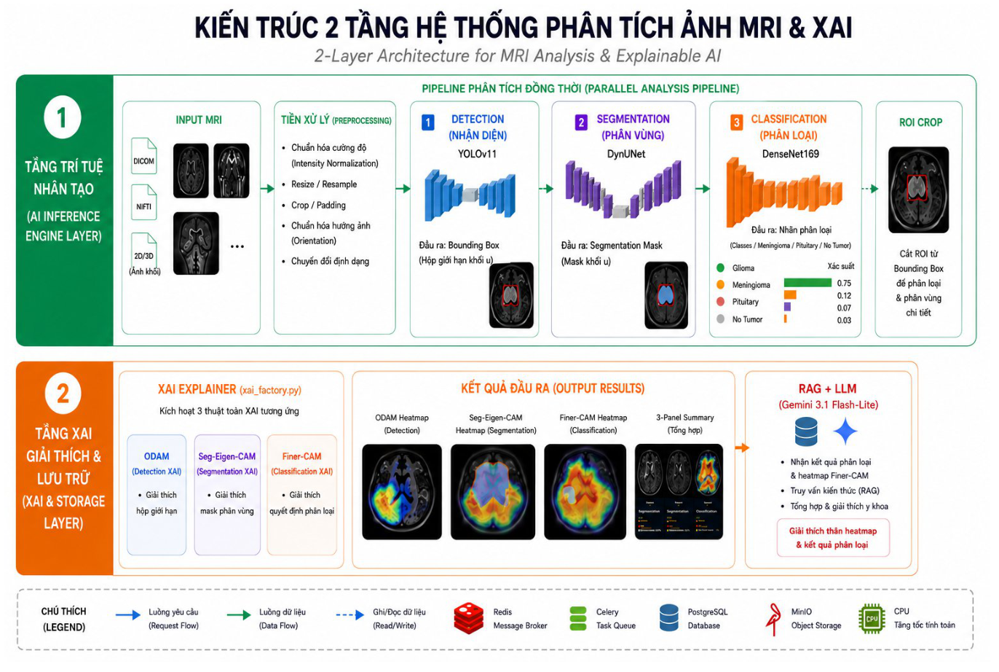

### End-to-end MRI, XAI and RAG flow

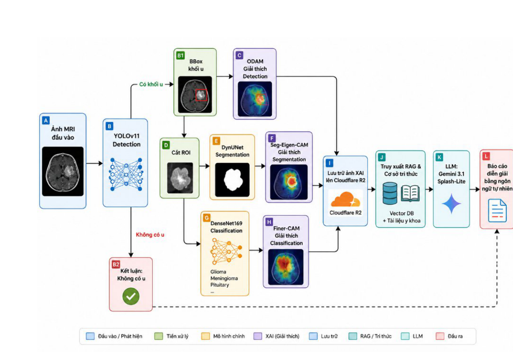

The operational sequence is:

```text
MRI upload
  -> YOLOv11 detection
     -> no tumor: stop downstream tumor prognosis and return a review notice
     -> tumor detected:
        -> crop ROI
        -> DynUNet segmentation
        -> DenseNet169 classification
        -> ODAM + Seg-Eigen-CAM + Finer-CAM
        -> persist structured results and visual artifacts
        -> retrieve supporting knowledge
        -> generate a grounded clinical explanation
```

## Module 1: MRI Diagnosis

### Inputs

- single MRI images in supported raster or DICOM form;
- DICOM series with representative-slice selection;
- NIfTI data where supported by the preprocessing workflow.

### Pipeline stages

| Stage | Model or method | Purpose | Stored evidence |
|---|---|---|---|
| Preprocessing | intensity normalization, resize/resample, orientation and format handling | Standardize heterogeneous MRI input | Prepared image or series metadata |
| Detection | YOLOv11 | Decide whether a suspicious tumor region exists and localize it | Bounding box, confidence, ODAM |
| ROI extraction | bbox-guided crop | Restrict downstream reasoning to the detected lesion | ROI and masked ROI |
| Segmentation | MONAI DynUNet | Delineate the tumor at pixel level | Binary mask, contour, Dice/IoU fields, Seg-Eigen-CAM |
| Classification | DenseNet169 | Classify tumor-positive ROI into three primary classes | Class probabilities, AI label, confidence, Finer-CAM |
| Series aggregation | consensus majority voting | Improve consistency across a DICOM sequence | Series label, key slice and per-slice evidence |
| Interpretation | local RAG + Gemini | Explain the classification and XAI evidence | Natural-language explanation and retrieval metadata |

### Tumor-negative safety rule

If detection concludes `no_tumor_detected = true`, the system returns **No tumor detected**, leaves tumor classification fields empty, and does not calculate or present a multimodal risk score for that MRI event. This rule is enforced in the backend pipeline rather than being a frontend-only display condition.

### Representative MRI outputs

| Detection | Segmentation | Classification XAI |
|---|---|---|
|  |  |  |

## Module 2: Multimodal Prognosis

The prognosis model estimates relative survival risk from up to four modalities. Every available branch is projected to a 512-dimensional representation before masked gated-attention fusion and a CoxPH prediction head.

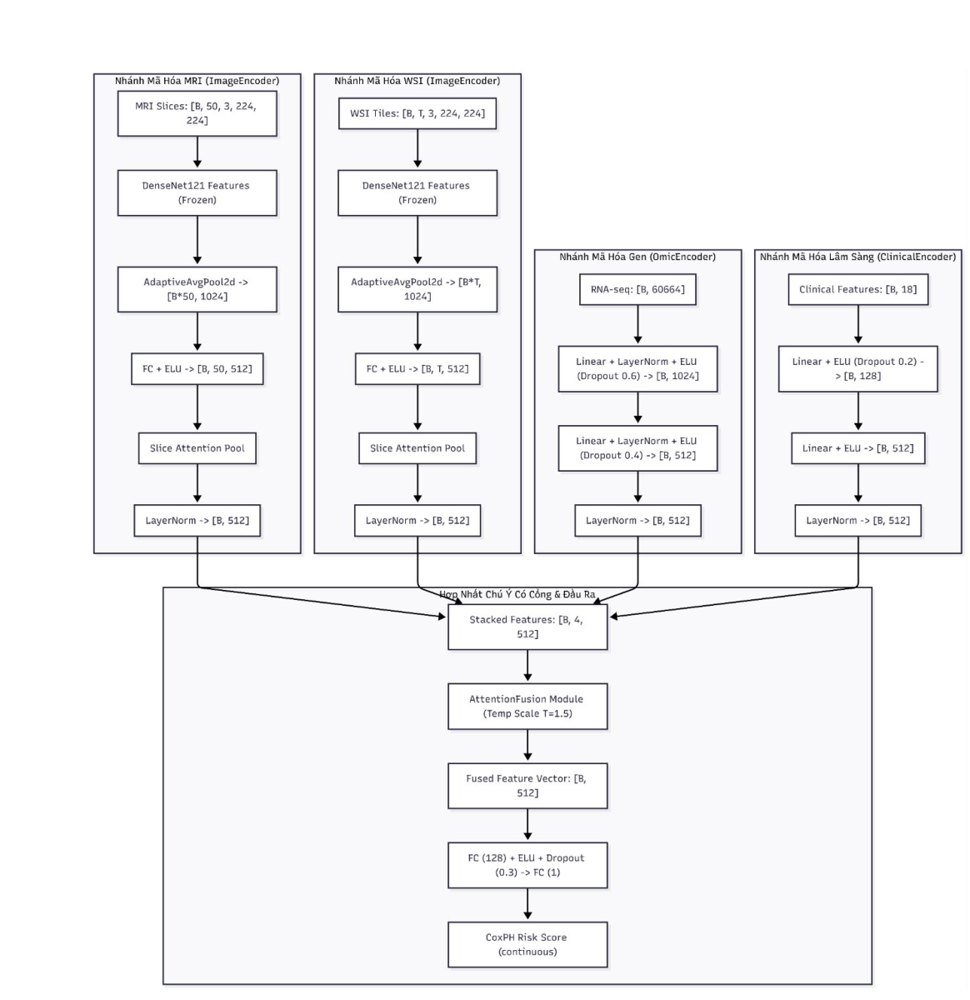

### Modality-specific processing

| Modality | Preprocessing | Encoder | Representation |
|---|---|---|---|
| MRI | orientation normalization, smart slicing, Min-Max scaling, 256 x 256 resize | Frozen DenseNet121 image encoder + slice attention | 512-D |
| WSI | OpenSlide access, tissue-aware grid tiling, HSV saturation filtering, 256 x 256 tiles | Frozen DenseNet121 image encoder + tile attention | 512-D |
| RNA-seq | STAR-count parsing, Ensembl ID normalization, duplicate aggregation, `log2(TPM + 1)` | MLP with LayerNorm and dropout | 512-D |
| Clinical | survival-event construction, time normalization, Min-Max and one-hot encoding | Two-layer clinical MLP | 512-D |

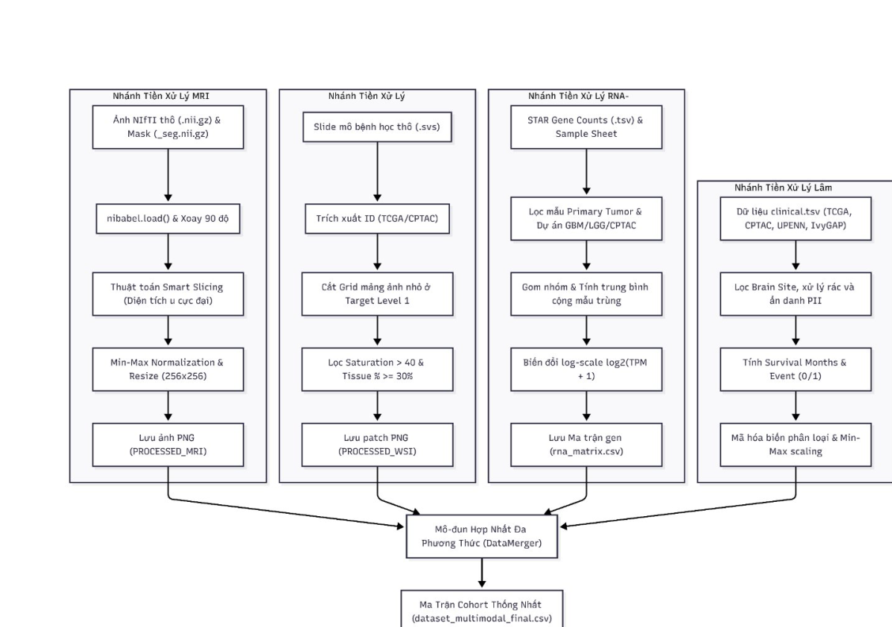

### Missing-modality handling

For each patient, the model builds a mask:

```text
[has_mri, has_wsi, has_rna, has_clinical]
```

An absent modality receives a zero-valued 512-D vector. Before softmax, its attention logit is assigned a large negative value, forcing its normalized fusion weight toward zero. This preserves tensor shape while preventing missing branches from influencing the prediction.

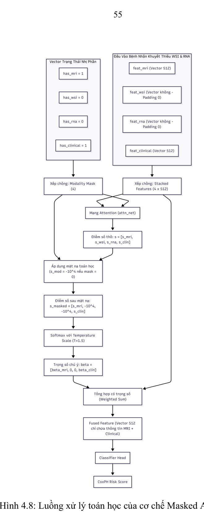

### Prognosis outputs

- continuous CoxPH risk score;
- categorical risk group;
- modality-level fusion-attention weights;
- Kaplan-Meier-compatible survival-curve data;
- MRI/WSI risk heatmaps using Grad-CAM, Grad-CAM++ and LayerCAM;
- top RNA-seq features with high-risk or protective attribution;
- generated clinical interpretation.

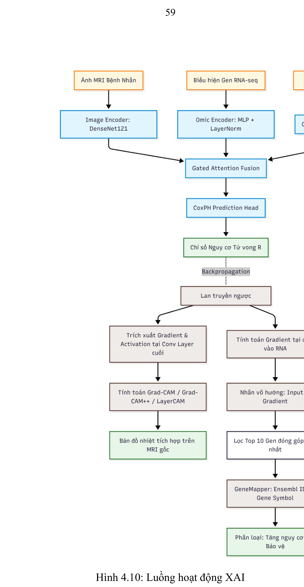

## Explainable AI

The system does not apply one generic heatmap to all model branches. Explanation targets are selected according to the semantics of each task.

### Detection: ODAM

ODAM explains one YOLO detection instance using gradients of both the class score and decoded bounding-box coordinates. The maps are combined and projected back to the original image space.


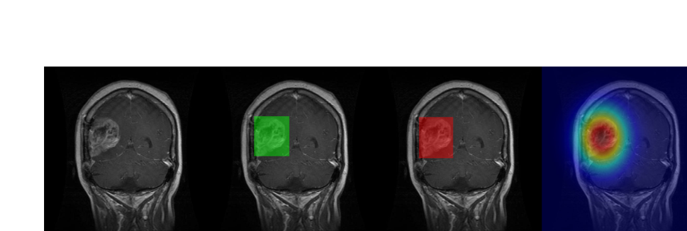

### Segmentation: Seg-Eigen-CAM

Seg-Eigen-CAM backpropagates from tumor-region logits, combines absolute gradients with activations, extracts the dominant component through SVD, corrects its sign, normalizes it and overlays the result on the ROI.


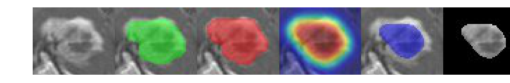

### Classification: Finer-CAM

Finer-CAM explains the difference between the predicted class logit and a semantically close reference class. This contrastive objective emphasizes class-discriminative evidence rather than generic salient anatomy.

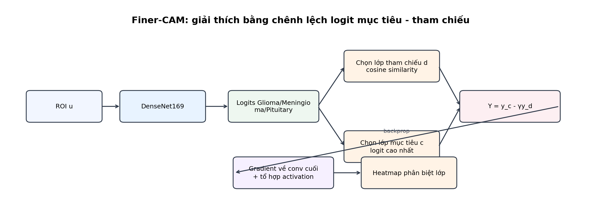

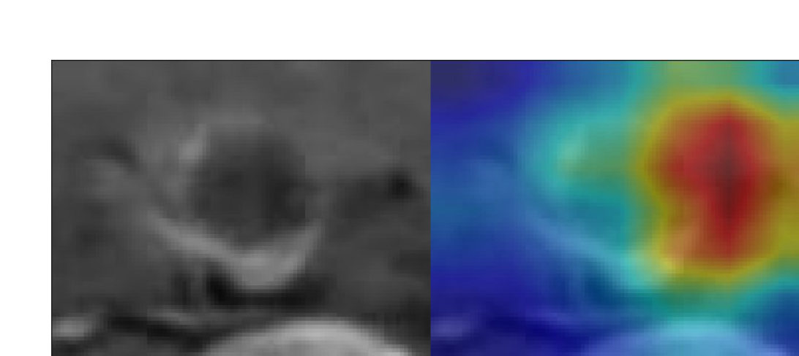

### Prognosis: visual and genomic attribution

For risk prediction, CAM variants explain image branches and Input x Gradient explains RNA-seq contribution. Positive gene attribution is presented as risk-increasing evidence and negative attribution as protective evidence; neither is interpreted as causal biology.

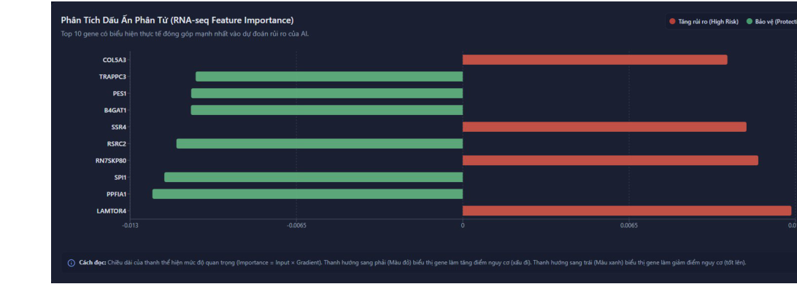

> [!NOTE]
> XAI visualizes evidence used by the model. A heatmap is not histopathological proof, and a gene attribution score is not a causal biomarker claim.

## Clinical Chatbox Agent

The floating NeuroDiagnosis Agent is an application layer over the existing clinical APIs and AI workflows. It is available across dashboard pages and receives the user's message together with page context such as `current_page`, `patient_id`, `image_id` and an optional selected image region.

### Agent execution graph

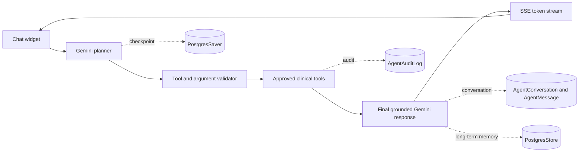
```mermaid
flowchart LR
    UI[Chat widget] --> P[Gemini planner]
    P --> V[Tool and argument validator]
    V --> T[Approved clinical tools]
    T --> F[Final grounded Gemini response]
    F --> SSE[SSE token stream]
    SSE --> UI
    P -. checkpoint .-> CP[(PostgresSaver)]
    F -. conversation .-> DB[(AgentConversation and AgentMessage)]
    F -. long-term memory .-> LS[(PostgresStore)]
    T -. audit .-> AL[(AgentAuditLog)]
```

### Implemented Agent capabilities

- LLM-based intent planning rather than page-only or keyword-only routing;
- patient-profile, diagnosis-history, image-analysis and notification tools;
- validation of allowed tools and required `patient_id` or `image_id` arguments;
- server-sent event streaming, with the complete assistant message persisted only after generation completes;
- conversation history with reload, soft delete, trim and LLM summary operations;
- LangGraph checkpointing with `PostgresSaver`;
- long-term user memory with `PostgresStore`;
- patient- and image-aware audit logging;
- quick MRI upload from the chatbox;
- human-in-the-loop interruption when quick MRI diagnosis has no patient context;
- automatic continuation after patient selection, result summary in chat and navigation to the full result page;
- Markdown rendering, copy actions, timestamps and zoomable MRI result images in the chat UI.

### Grounding and RAG

Classification explanations use a local child-parent retrieval store with precomputed BGE-M3 child embeddings. Query embeddings and optional reranking are obtained through Hugging Face inference endpoints. The top grounded contexts, structured model outputs and XAI metadata are passed to Gemini; generated text is validated and falls back to a deterministic explanation if generation is unavailable or unsafe.

### Human review semantics

Every tumor classification can be reviewed, including high-confidence predictions. Confidence below 0.95 only triggers a stronger warning. A review records the original AI label, AI confidence, expert label, comment and whether the expert **confirmed** or **corrected** the prediction.

## Web CDSS and Asynchronous Processing

### Four-tier application architecture

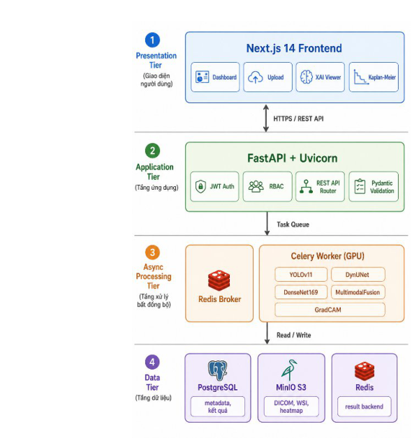

| Tier | Main components | Responsibility |
|---|---|---|
| Presentation | Next.js, React, TypeScript, Cornerstone | Patient workflows, uploads, result visualization, XAI and chat |
| Application | FastAPI, Pydantic, SQLAlchemy, JWT/RBAC | Validation, authorization, records, task creation and reporting |
| Async inference | Redis, Celery, GPU worker | MRI and prognosis pipelines outside the HTTP request lifecycle |
| Data | PostgreSQL, MinIO/R2, Redis result backend | Structured records, object artifacts, task state and memory |

### Why Redis and Celery are required

GPU inference is too long-running and resource-intensive for a normal HTTP request. FastAPI therefore validates the request, creates an `InferenceTask`, sends a Celery signature to Redis, and immediately returns a task identifier. A Celery worker consumes the queued task, runs the AI pipeline, stores the result and updates its status. The frontend polls task state and renders the completed output without holding an HTTP connection open for the entire inference run.

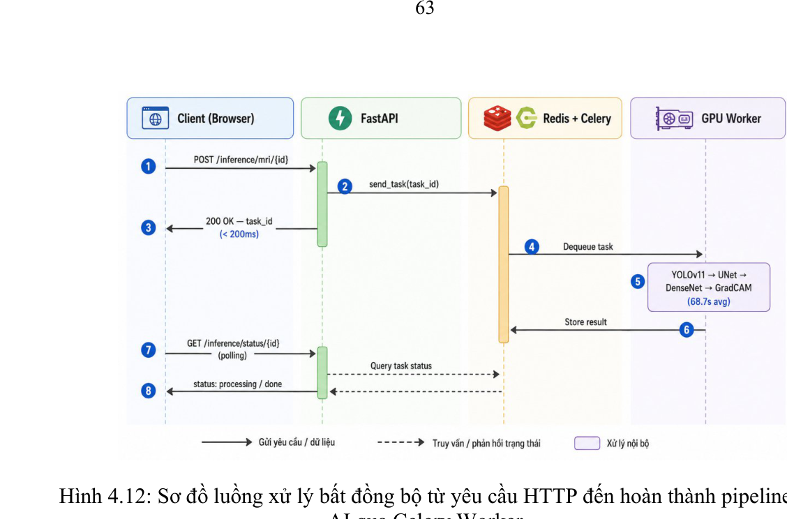

### Data model

The relational model separates patient identity, uploaded modalities, task lifecycle, AI outputs, review records, history reports, accounts and audit logs.

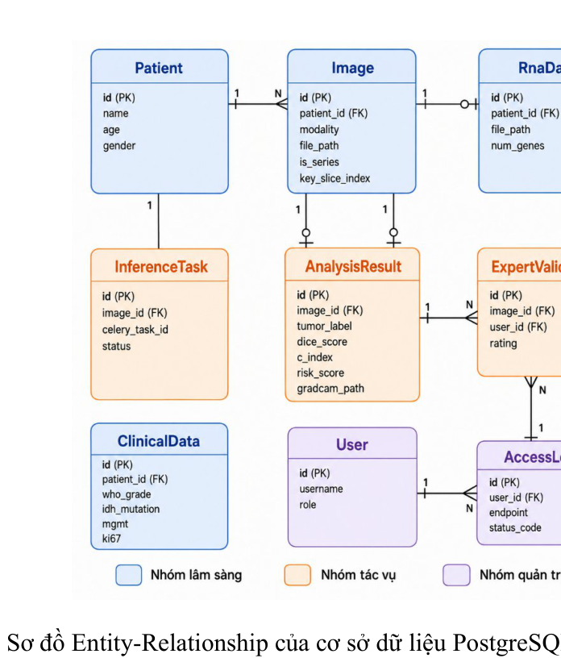

The current implementation also includes Agent-specific tables:

- `agent_conversations` for thread-level context and summaries;
- `agent_messages` for user and assistant messages;
- `agent_audit_logs` for tool and chat activity;
- LangGraph checkpoint/store tables managed by `PostgresSaver` and `PostgresStore`.

### Container deployment

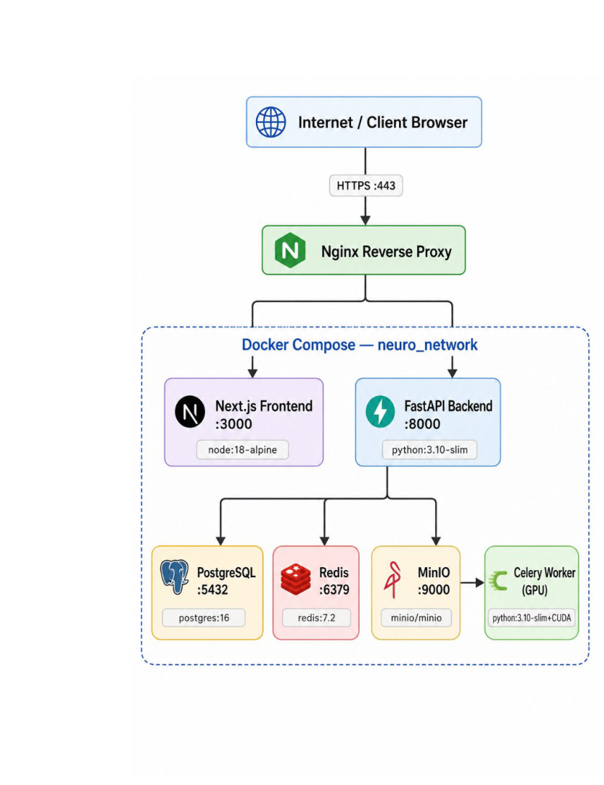

Two deployment modes are maintained:

- **Local:** Next.js + FastAPI + Celery + Redis + PostgreSQL + MinIO.
- **Tunnel deployment:** Vercel frontend + Cloudflare Quick Tunnel + local FastAPI/Celery/GPU + PostgreSQL/Redis + Cloudflare R2.

## Experimental Design

### MRI diagnosis dataset

The research uses the Bangladesh Brain Cancer MRI dataset for model development and a standardized held-out evaluation set of 424 images:

| Class | Evaluation samples | Share |
|---|---:|---:|
| Glioma | 116 | 27.36% |
| Meningioma | 102 | 24.06% |
| Pituitary | 108 | 25.47% |
| Normal | 98 | 23.11% |
| **Total** | **424** | **100%** |

Detection is evaluated on all 424 images. Segmentation and three-class ROI classification are evaluated on the 326 tumor-positive images.

### Multimodal prognosis cohort

The merged cohort contains 899 patients from five neuro-oncology sources:

| Cohort | Patients |
|---|---:|
| UPENN-GBM | 585 |
| TCGA-GBM | 133 |
| TCGA-LGG | 122 |
| IvyGAP | 31 |
| CPTAC-GBM | 28 |
| **Total** | **899** |

The report uses 719 patients for training and 180 for independent validation, with event-stratified splitting for survival evaluation.

## Experimental Results

All values in this section are transcribed from the supplied 2026 research report. They describe the documented experimental setting, not external prospective clinical validation.

### Summary

| Task | End-to-end or broad result | Tumor-ROI or task-specific result |
|---|---:|---:|
| YOLOv11 detection | Precision 95.25%, Recall 86.20%, F1 90.50% | mAP@50 85.39%, mean IoU on matched tumor boxes 73.34% |
| DynUNet segmentation | Mean Dice 87.42% | Dice 92.77%, IoU 87.03% on tumor-positive ROIs |
| DenseNet169 classification | Accuracy 93.86%, AUC > 0.92 | Accuracy 97.55%, Macro-F1 97.54% on detected tumor ROIs |
| Multimodal CoxPH prognosis | Best validation C-index 0.6936 | C-index 0.654-0.668 under random WSI/RNA missingness |

The distinction between broad pipeline performance and ROI-only performance is essential: ROI metrics evaluate downstream models after a tumor region is available and therefore should not be presented as end-to-end diagnostic performance.

### Detection

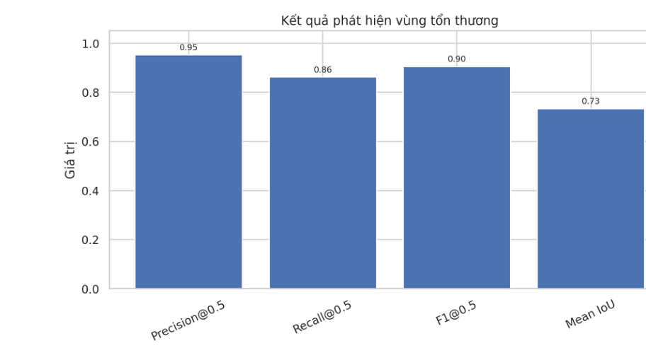

| Metric | Value |
|---|---:|
| Precision@0.5 | 95.25% |
| Recall@0.5 | 86.20% |
| F1@0.5 | 90.50% |
| mAP@50 over the 424-image evaluation set | 85.39% |
| Mean IoU on images with matched ground-truth boxes | 73.34% |
| Mean detection inference time | 0.0345 s/image |

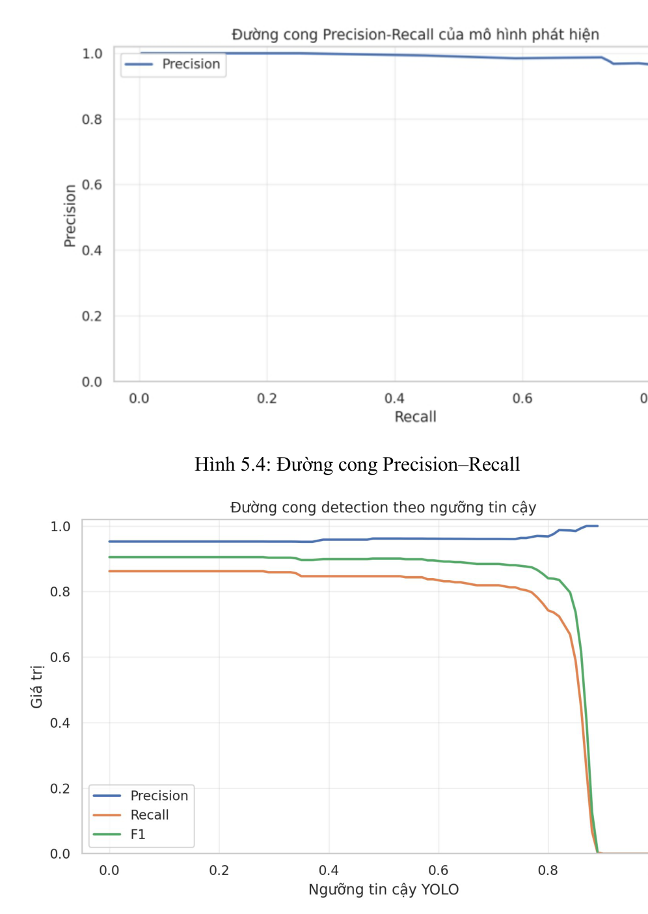

The report identifies Glioma as the most difficult detection group because of heterogeneous shape, diffuse boundaries and surrounding edema. This is reflected in lower group AP and a higher false-negative burden than for Pituitary tumors.

### Segmentation

| Metric on 326 tumor-positive ROIs | Value |
|---|---:|
| Dice | 92.77% |
| IoU | 87.03% |
| Sensitivity | 92.77% |
| Specificity | 96.83% |
| HD95 | 5.52 px |

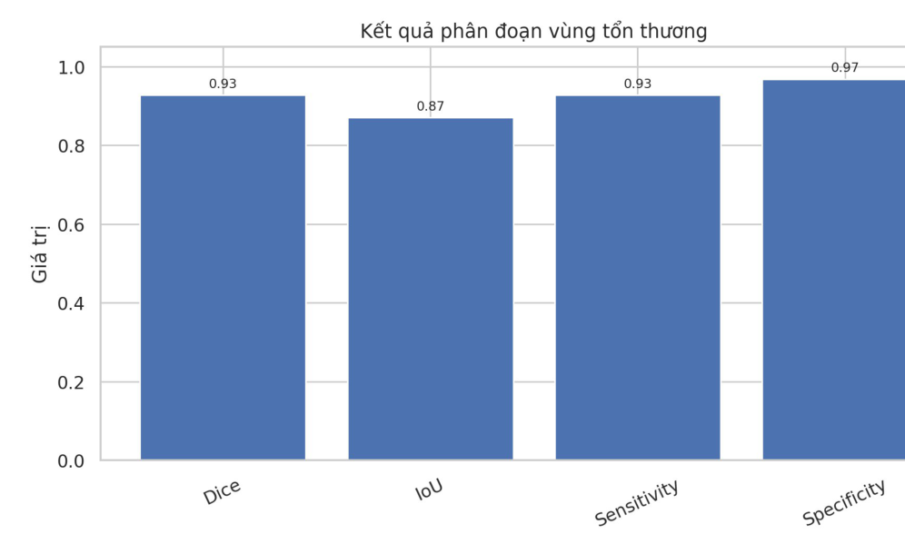

Meningioma achieved the strongest class-wise segmentation result in the report (Dice 95.41%, IoU 91.41%), while Glioma remained more difficult because of irregular and infiltrative boundaries.

### Classification

| Metric on 326 tumor ROIs | Value |
|---|---:|
| Accuracy | 97.55% |
| Macro-F1 | 97.54% |
| Weighted-F1 | 97.55% |
| Top-2 accuracy | 100.00% |
| Total classification errors | 8/326 |

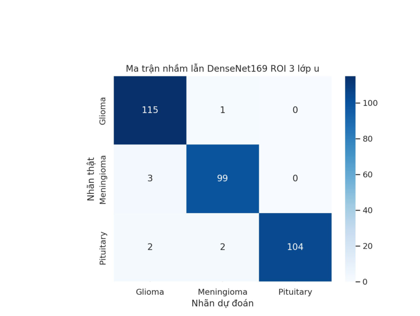

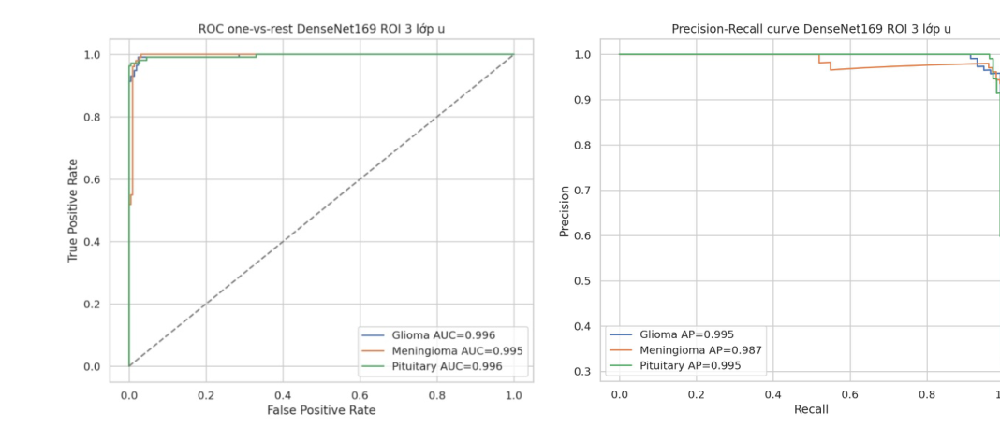

At a 0.95 confidence threshold, the documented ROI subset reaches 99.00% accuracy and 99.00% Macro-F1 at 92.33% coverage. The application uses this threshold as a review-warning policy, not as an automatic prohibition on expert review.

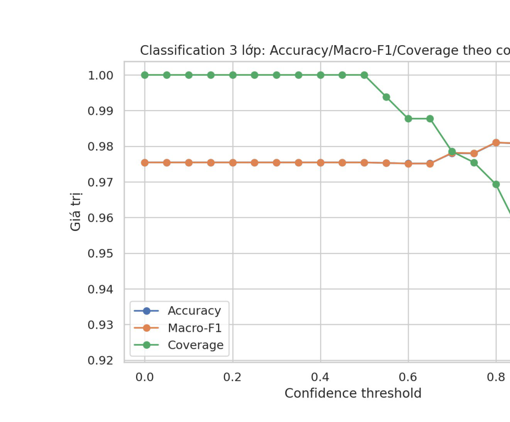

### XAI evaluation

| XAI method | Evaluation population | Key reported evidence |
|---|---|---|
| ODAM | 293 valid matched detections | Pointing game 98.98%; confidence drop 59.36%, 70.28% and 82.55% when masking the top 5%, 10% and 20% regions |
| Seg-Eigen-CAM | 326 tumor ROIs | Pointing game on ground-truth mask 99.08%; energy inside GT mask 78.08%; energy inside predicted mask 79.02% |
| Finer-CAM | 326 classified ROIs | Mean confidence 98.17%; compactness@0.5 72.00%; Drop@20 23.77%; Relative Drop@20 41.50% |

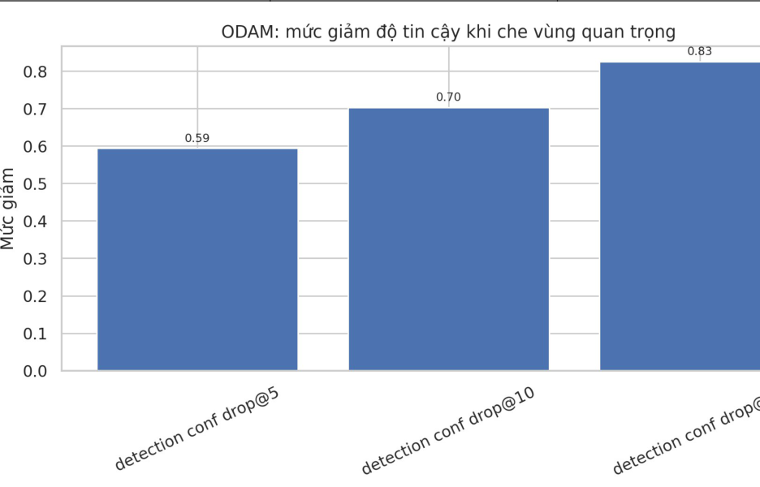

These metrics test localization and faithfulness of model explanations. They do not establish clinical validity by themselves.

### Multimodal survival prognosis

The best validation C-index is **0.6936 at epoch 11**. Under random WSI or RNA-seq omission, masked gated-attention fusion retains a C-index in the **0.654-0.668** range without pipeline failure, supporting the intended missing-modality tolerance.

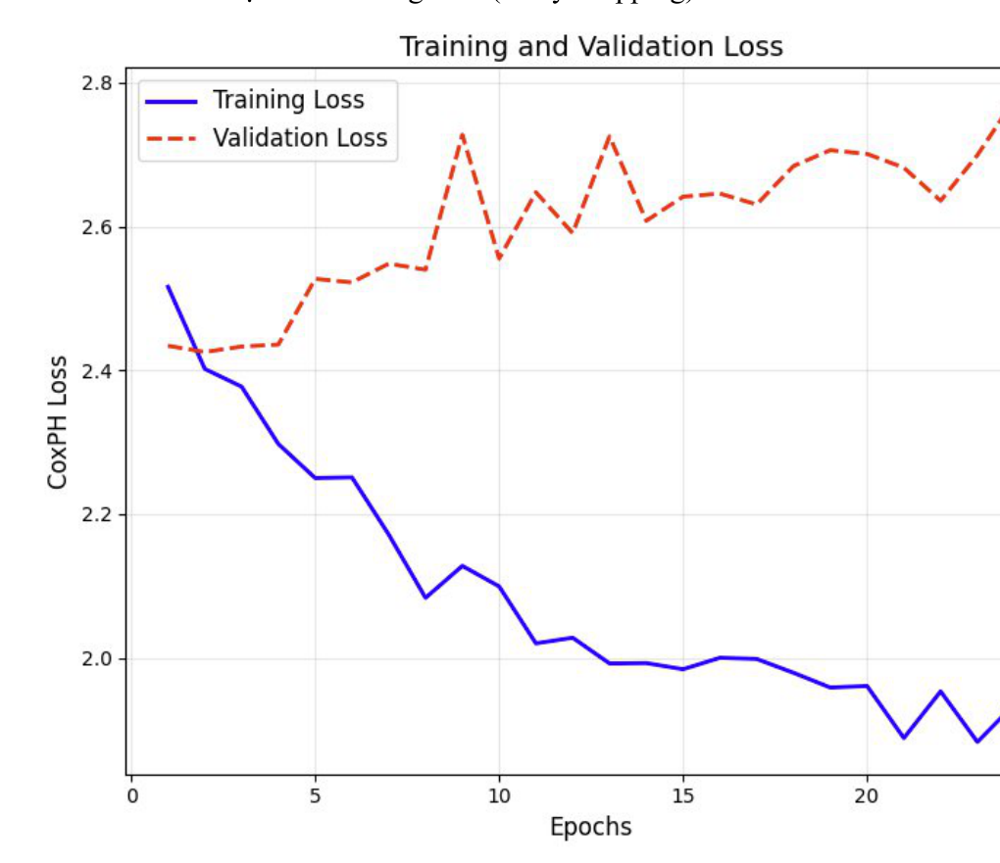

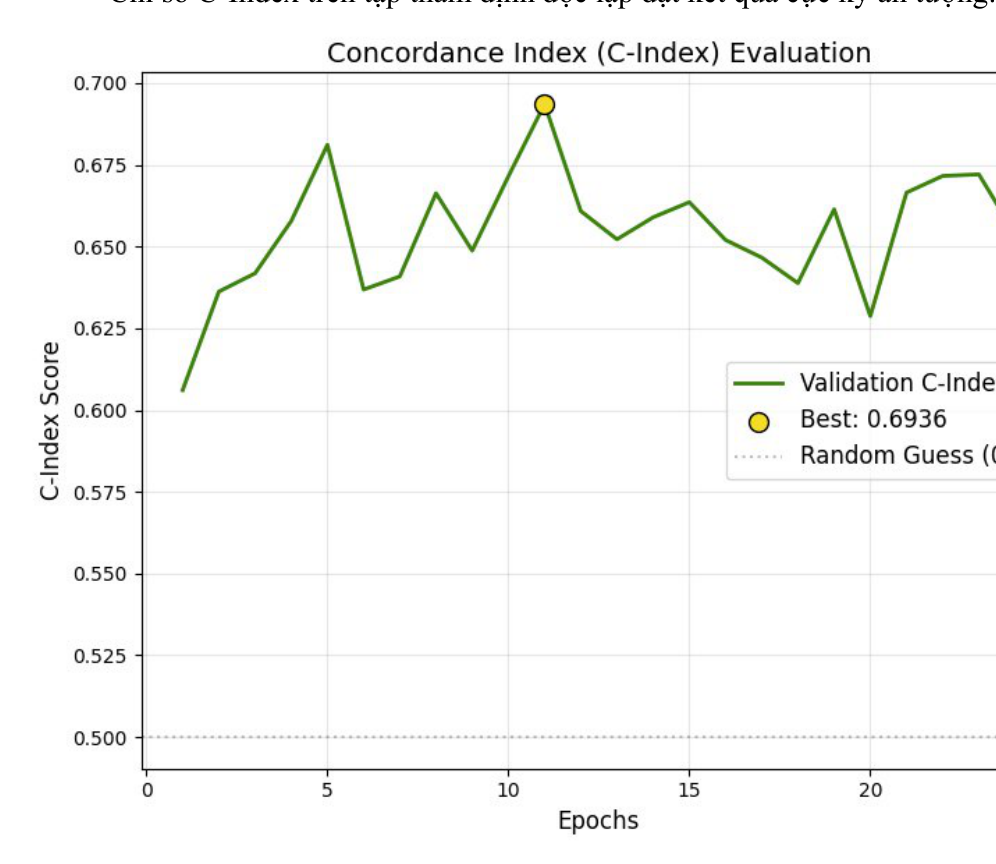

### Web system evaluation

| System measure | Reported value |
|---|---:|
| API error rate under the documented test load | 0.04% |
| 30-day health-check availability | 99.92% |
| Average end-to-end MRI response | 4.2 s/case |
| Average end-to-end multimodal response | 12.8 s/case |
| Lighthouse Performance | 84/100 |
| Lighthouse Accessibility | 92/100 |
| Lighthouse Best Practices | 95/100 |
| Lighthouse SEO | 90/100 |
| Specialist trust/acceptance rating | 4.6/5 |

## Repository Structure

```text
.
|-- backend/
|   |-- agent/                 LangGraph planner, validator, tools and memory
|   |-- ai_core/               MRI, prognosis and XAI model implementations
|   |-- rag/xai/               Local child-parent RAG artifacts and embeddings
|   |-- routers/               FastAPI route modules
|   |-- services/              RAG and Gemini explanation services
|   |-- migrations/            Database migrations
|   |-- celery_app.py          Celery configuration
|   |-- task.py                Asynchronous AI tasks
|   `-- main.py                FastAPI application entry point
|-- frontend/
|   |-- src/app/               Next.js routes and clinical screens
|   |-- src/components/        Layout, result, visualization and Agent UI
|   |-- src/contexts/          Authentication, theme and Agent context
|   |-- src/hooks/             Streaming and UI hooks
|   `-- src/lib/               API clients and shared utilities
|-- assets/readme/             Architecture and experimental figures
|-- docker-compose.yml         Full local stack
|-- docker-compose.tunnel.yml  GPU backend stack for Vercel/tunnel deployment
|-- SETUP_GUIDE.md             Complete setup instructions
`-- TUNNEL_DEPLOY_GUIDE.md     Tunnel deployment workflow
```

## API Overview

The complete, executable API specification is available from FastAPI Swagger at `/docs`. Major endpoint groups include:

| Group | Representative endpoints |
|---|---|
| Authentication | `POST /auth/login` |
| Patients and history | `GET/POST /records/patients`, `GET /records/patients/{patient_id}`, `GET /records/patients/{patient_id}/history-report` |
| Upload | `POST /upload/mri/`, `POST /upload/mri/series`, `POST /upload/wsi/series`, `POST /upload/rna/` |
| Inference | `POST /inference/mri/{image_id}`, `POST /inference/prognosis/{patient_id}`, `GET /inference/tasks/{task_id}` |
| Results and XAI | `GET /records/analysis/image/{image_id}`, `GET /records/analysis/image/{image_id}/report`, `POST /records/analysis/image/{image_id}/validate` |
| Classification review | `POST /records/analysis/image/{image_id}/classification-review` |
| Agent | `POST /agent/chat`, `POST /agent/chat/stream`, `GET /agent/conversations`, `POST /agent/quick-mri` |
| Administration | `GET /admin/logs` |

## Getting Started

### Prerequisites

- Git and Git LFS;
- Docker Desktop with Docker Compose;
- NVIDIA GPU, current driver and Docker GPU access for accelerated inference;
- Node.js only when running the frontend outside Docker;
- Gemini and Hugging Face API credentials for Agent/RAG generation;
- Cloudflare R2 credentials only for tunnel deployment.

### 1. Clone and download model weights

```bash
git clone git@github.com:Dang123-ui/brain-tumor-multimodal-xai.git
cd brain-tumor-multimodal-xai
git lfs install
git lfs pull
```

Required model files are expected under `backend/ai_core/weights/`:

```text
yolo_weights.pt
unet_weights.pt
densenet169_weights.pth
best_multimodal_model.pth
```

### 2. Configure environment variables

Use `.env.example` as the variable reference for local development and `.env.tunnel.example` for the tunnel stack. At minimum, replace the placeholder JWT, object-storage, Gemini and Hugging Face values. Never commit `.env`, `backend/.env`, or `.env.tunnel`.

### 3. Run the complete local stack

```powershell
docker compose up -d --build
docker compose ps
curl.exe http://localhost:8000/health
```

Local services:

| Service | URL |
|---|---|
| Web application | `http://localhost:3000` |
| FastAPI Swagger | `http://localhost:8000/docs` |
| MinIO console | `http://localhost:9001` |

### 4. Inspect logs

```powershell
docker compose logs -f backend
docker compose logs -f worker
```

### 5. Run the frontend independently

```powershell
cd frontend
npm install
notepad .env.local
npm run dev
```

Set the following value in `frontend/.env.local` before starting Next.js:

```env
NEXT_PUBLIC_API_URL=http://localhost:8000
```

### Tunnel/Vercel deployment

The project also supports a Vercel frontend connected to a locally hosted GPU backend through a Cloudflare Quick Tunnel and Cloudflare R2. Follow [TUNNEL_DEPLOY_GUIDE.md](TUNNEL_DEPLOY_GUIDE.md) for the exact command order and environment configuration.

```powershell
docker compose -f docker-compose.tunnel.yml --env-file .env.tunnel up -d
cloudflared tunnel --protocol http2 --url http://localhost:8000
```

The generated `https://...trycloudflare.com` address must be assigned to Vercel's public `NEXT_PUBLIC_API_URL` configuration and the frontend must then be redeployed.

## Security and Data Governance

- JWT bearer authentication protects authenticated API operations.
- RBAC separates doctor and researcher permissions.
- DICOM upload preprocessing removes identifying tags before object storage where configured.
- Presigned object URLs avoid exposing storage credentials to the browser.
- Access logs and Agent audit logs support traceability.
- Patient, inference, review and Agent records are stored separately in PostgreSQL.
- Secrets are loaded from environment variables and must never be hard-coded or committed.

Before any real-world use, replace all development credentials, enable managed TLS and secret rotation, define retention and backup policies, review DICOM de-identification against local regulation, and complete institutional security and clinical validation.

## Limitations

- The reported results are retrospective and dataset-specific; they are not evidence of prospective clinical effectiveness.
- The MRI diagnosis dataset is public and does not represent every scanner, protocol, institution or population.
- ROI-only segmentation and classification metrics are conditional on tumor localization and must not be interpreted as whole-pipeline metrics.
- The survival cohort remains small relative to the 60,664-dimensional RNA input, creating overfitting and generalization risk.
- Missing-modality robustness does not eliminate bias from systematically unavailable modalities.
- XAI localization and perturbation metrics measure model behavior, not biological or clinical causality.
- The Quick Tunnel deployment is appropriate for demonstration, not a production hospital network.
- The system requires external validation, calibration, monitoring, governance and regulatory assessment before clinical deployment.

## Clinical and Research Use

NeuroDiagnosis AI is intended to support research, education and clinician review. It must not autonomously determine treatment, replace radiological or pathological assessment, or be used as the sole basis for patient care.

## Citation

If this repository supports your research, cite the project as:

```bibtex
@misc{neurodiagnosisai2026,
  title        = {Development of a Multimodal Deep Learning Model with XAI for Supporting Brain Tumor Diagnosis and Prognosis},
  author       = {Pham Huynh Quoc Dat and Nguyen Hai Dang and Vuong Quoc An},
  year         = {2026},
  howpublished = {GitHub repository},
  url          = {https://github.com/Dang123-ui/brain-tumor-multimodal-xai},
  note         = {Research prototype submitted to the 28th Eureka Student Research Award}
}
```

## Authors

- **Phạm Huỳnh Quốc Đạt**
- **Nguyễn Hải Đăng**
- **Vương Quốc An**

Academic advisor: **Dr. Trịnh Hùng Cường**

## Acknowledgment

Architecture diagrams, evaluation plots and reported measurements in this README were adapted from the supplied 2026 full research report. The implementation additionally documents the current LangGraph clinical Agent and human-in-the-loop workflows present in this repository.
